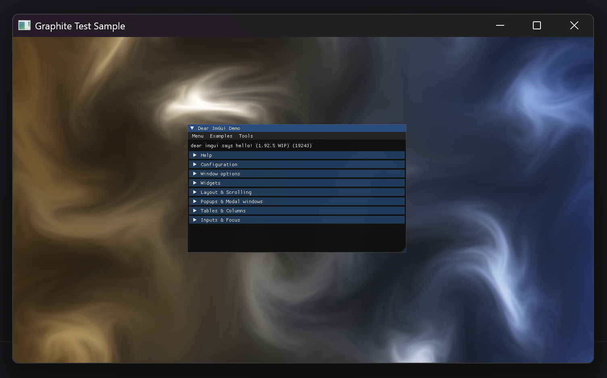
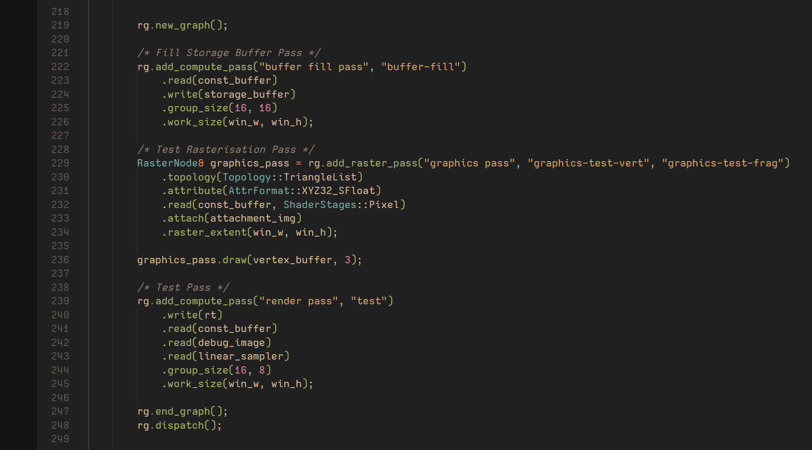

<h1 align="center">
    

      Graphite
    

</h1>

  Cross-platform <b>Render</b> Graph. 

 

    

## Brief
This repository contains a render graph I designed for use in two projects during my time studying at [BUas](https://www.buas.nl/).  
It's interface is designed to be user-friendly and readable, inspired by [Kajiya](https://github.com/EmbarkStudios/kajiya/).

This repository only features a Vulkan back-end for PC, however I also made a PS5 back-end for the render graph.  
> I cannot share the PS5 back-end due to having signed an NDA.

 

<h2></h2>

    © 2025 Max &lt;mxcop&gt;, All rights reserved — <a href="./license.md">MIT</a>.

